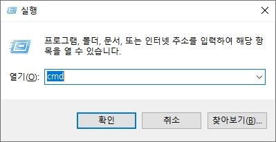
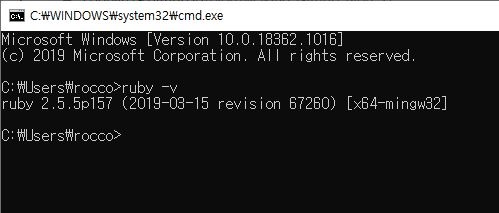
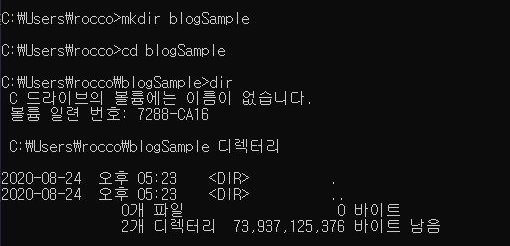
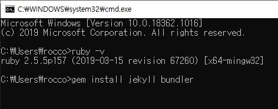
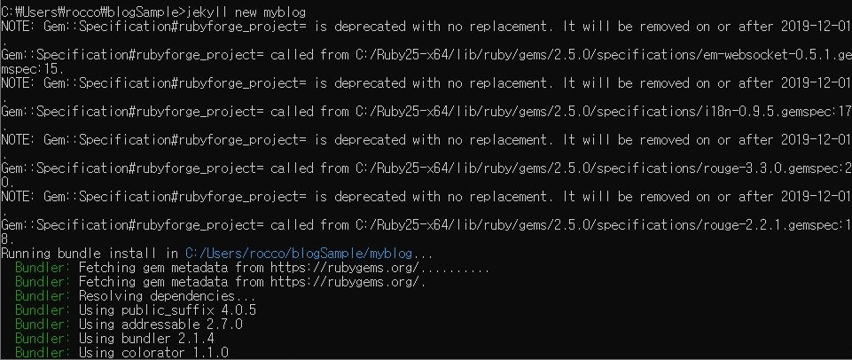
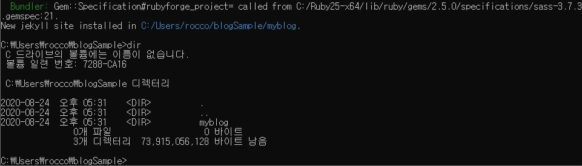
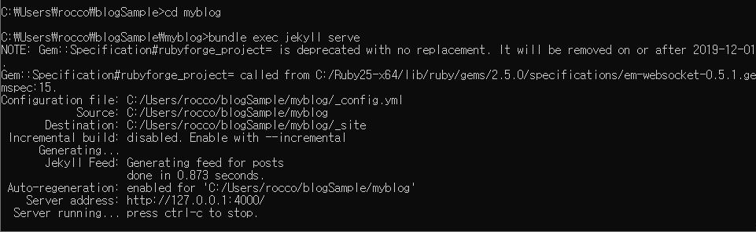
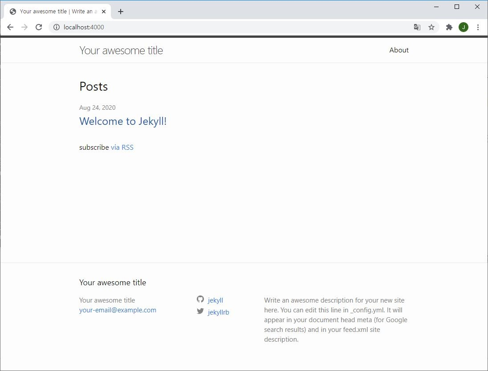

# 지킬로 깃헙 블로그 만들기

## 깃헙 블로그?

블로그면 블로그지, 지킬은 뭐고, 깃헙 블로그는 또 뭐람?

간단히 설명하자면, 네이버 블로그는 네이버 웹사이트를 통해 만든 블로그이고,

티스토리 블로그는 티스토리 웹사이트를 통해 만든 블로그이듯이,

깃헙 블로그는 깃헙을 통해 만든 블로그다.

그리고 지킬은 블로그를 만드는 도구라고 간단히 생각하면 된다.

<br>

## 루비와 지킬 설치하기

차근차근 깃헙 블로그를 만들어보자.

깃헙블로그는 다양한 방법으로 만들 수 있는데, 이 포스트에서는 지킬을 사용해 만들겠다.

[지킬 홈페이지의 설명](https://jekyllrb-ko.github.io/docs/)을 따라하면 블로그를 만들 수 있는데,

먼저 지킬을 설치해야한다.

그리고 지킬을 설치하기 위해서는 루비를 설치해야한다.

루비는 [여기](https://rubyinstaller.org/downloads/)에서 설치파일을 받을 수 있다.

루비가 무사히 설치됐는지는 명령 프롬프트에서 `ruby -v` 명령어로 확인할 수 있다.

<br>



<br>

cmd창은 다음과 같이 `win + r`로 <실행>창을 켜서 `cmd`를 입력하면 명령 프롬프트(cmd창)를 열 수 있다.



<br>

명령프롬프트에 `ruby -v` 명령어로 설치된 루비의 버전을 확인할 수 있다.

<br>

## WEBrick 추가 설치

WEBrick은 간단한 HTTP 웹 서버를 제공하는 Ruby 라이브러리인데 ([참조](https://en.wikipedia.org/wiki/WEBrick)), ruby 3.0부터 기본으로 설치되는 gem에서 빠졌기 때문에, 수동으로 추가 설치가 필요하다.

WEBrick은 아래 명령어로 설치할 수 있다.

<br>

```
bundle add webrick
```

<br>


<br>

위 이미지와 같이 설치 후 아래를 진행하면 된다.

<br>

[WEBrick 이슈 관련 포스트](https://codejin19.github.io/blog/Making_Github_Blog_6/)

<br>

## 명령 프롬프트 연습

```cmd
gem install jekyll bundler
jekyll new myblog
cd myblog
bundle exec jekyll serve
```

지킬 홈페이지에 따르면 위에 있는 네 개의 명령어로 블로그를 만들 수 있다고 한다.

위 명령어들은 모두 명령 프롬프트를 통해 실행하는 것이다.

명령 프롬프트를 사용하는데 익숙하지 않은 사람들을 위해 간단히 설명하자면,

명령 프롬프트의 명령어는 기본적으로 [명령어]와 [옵션] 꼴로 이루어져있다.

블로그를 만들기 전에 간단한 명령어 실습을 통해 새 작업환경 (폴더)를 만들어보겠다.

<br>



<br>

현재 위치에서 `mkdir blogSample` 명령어를 통해 blogSample이라는 디렉토리(폴더)를 만들었다.

`mkdir` 명령어는 make direcoty의 줄임말로 디렉토리, 즉 폴더를 만드는 명령어다.

`mkdir` 명령어는 새로 만들 디렉토리의 이름을 옵션으로 받는다.

<br>

blogSample 디렉토리를 만든 후, `cd blogSample` 명령어로 현재 위치를 blogSample 디렉토리로 이동했다.

`cd` 명령어는 chanage direcoty의 줄임말로 이동할 디렉토리 위치를 옵션으로 받는다.

<br>

`blogSample`로 이동하고 `dir` 명령어를 통해 blogSample 디렉토리가 비어있음을 확인했다.

`dir` 명령어를 통해 현재 디렉토리에 있는 파일들과 디렉토리를 확인할 수 있다.

<br>


<br>

윈도우 창으로 확인해보면 사용자 디렉토리 밑에 blogSample이라는 이름의 하위 디렉토리가 생긴 것과 blogSample이 비어있음을 확인할 수 있다.

<br>

## 내컴퓨터에 블로그 만들기

```cmd
gem install jekyll bundler
jekyll new myblog
cd myblog
bundle exec jekyll serve
```

간단한 실습을 통해 cmd 명령어로 작업 폴더를 만들었으니, 저 명령어를 활용해서 블로그를 만들어보자.

<br>



<br>

`gem install jekyll bundler`은 gem한테 jekyll과 bundler를 설치하라는 명령어다.

gem은 처음에 설치한 루비라고 생각하면 편하다.

즉, 루비한테 jekyll과 bundler를 설치하라는 명령어다.

이 명령어로 jekyll과 bundler를 설치할 수 있다.

<br>



<br>

jekyll과 bundler를 설치했다면, `jekyll` 명령어를 사용할 수 있다.

`jekyll new myblog`는 지킬에게 myblog라는 블로그를 새로(new) 만들라는 명령어다.

지킬은 myblog라는 이름의 블로그를 만들고 이를 현재 위치 밑에 myblog라는 하위 디렉토리에 둔다.



<br>

`dir` 명령어를 통해 아까는 없었던 `myblog`라는 하위 디렉토리가 생성된 것을 확인할 수 있다.


<br>

윈도우 창으로도 `myblog`라는 하위 디렉토리가 생성된 것을 확인할 수 있다.

<br>



<br>

`cd myblog`로 현재 위치를 하위 디렉토리인 `myblog`로 이동한다.

`bundle exec jekyll serve`로 현재 디렉토리에서 블로그를 실행한다.

<br>



<br>

실행된 블로그는 인터넷 브라우저를 열어 https://localhost:4000에 접속하여 확인할 수 있다.