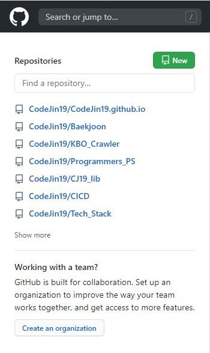
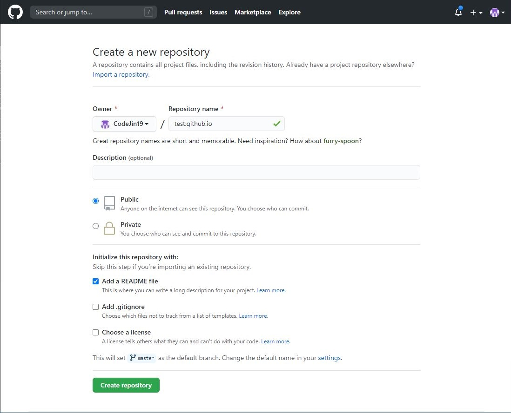
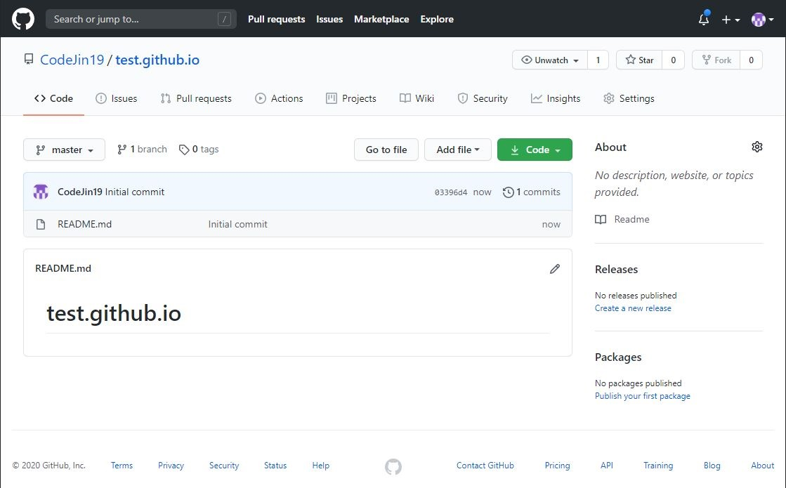
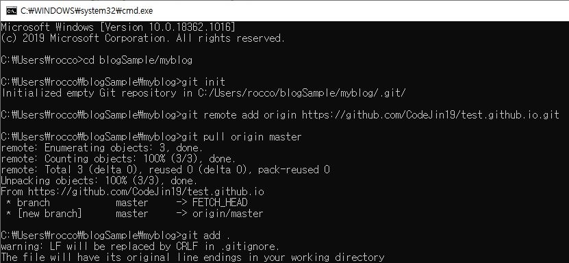
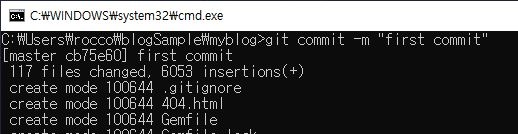
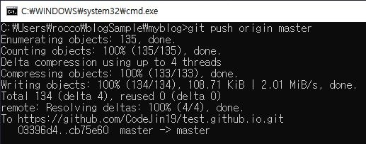
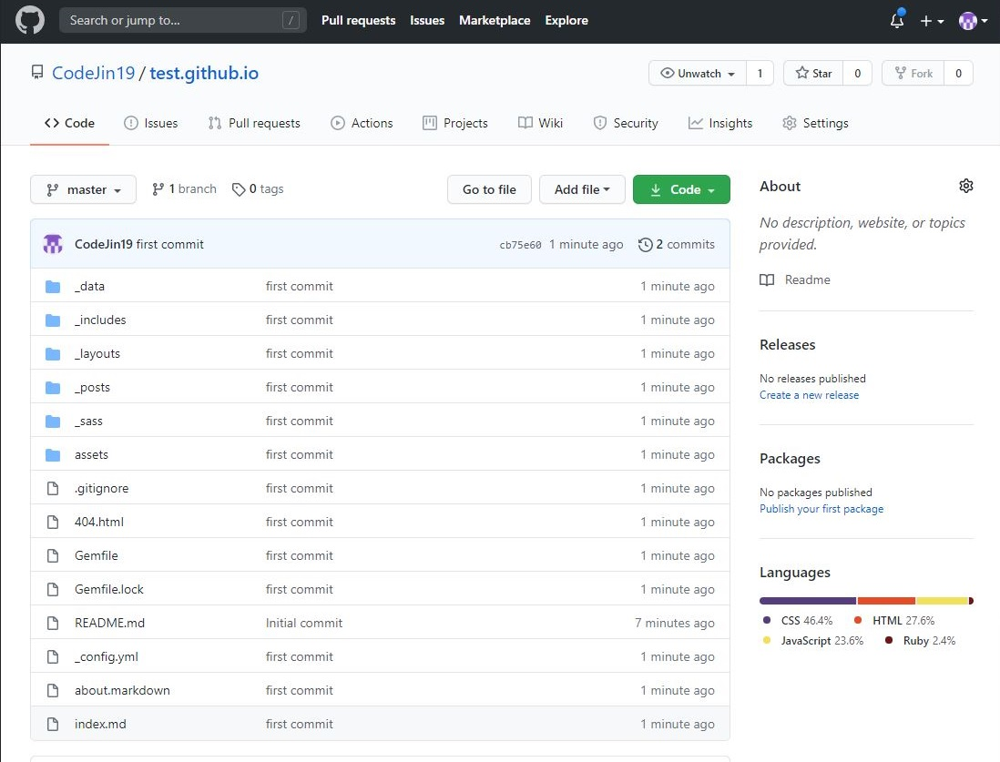

# 블로그 온라인에 띄우기

## 지난 시간에...

지난 두 포스트를 통해 지킬을 활용하여 블로그를 만들고, 테마를 적용했다.

하지만 블로그를 보기 위해서는 `bundle exec jekyll serve` 명령어를 통해 블로그를 실행해야하고, `localhost:4000` 주소로 접속해야 했다.

이번 포스트에서는 만든 블로그를 깃헙을 통해 온라인으로 올려보겠다.

<br>

## 레포지토리 만들기

깃헙을 통해 블로그를 띄울 것이기 때문에 우선 깃헙에 레포지토리를 만들어야 한다.

<br>

<center></center>

<br>

깃헙에 로그인하면 좌측에 `new` 버튼을 눌러 새 레포지토리를 만들자.

<br>

<center></center>

<br>

레포지토리 이름은 반드시 `(유저 ID).github.io` 꼴로 만들어야 한다.

하지만 나는 이미 같은 이름의 레포지토리가 있기 때문에 만들 수 없다는 경고가 나와서 다른 이름 `test.github.io` 으로 만들어보겠다.

<br>

<center></center>

<br>

레포지토리 설정은 public, 그리고 옵션은 add a README file 옵션만 체크하고 레포지토리를 생성한다.

<br>

<center></center>

<br>

레포지토리를 만들면 위와 같은 화면이 뜬다.

이제 내 컴퓨터(로컬)에 있는 블로그와 이 레포지토리를 연동하면 된다.

<br>

## 로컬과 레포지토리 연동하기

`win + r`, `cmd`로 명령 프롬프트를 열고, `cd` 명령어를 통해 내 블로그가 있는 디렉토리로 이동한다.

```cmd
git init
git remote add https://github.com/(유저_ID).github.io.git
git pull origin master
git add .
git commit -m "first commit"
git push origin master
```

명령 프롬프트로 위 6개의 명령어를 입력하면 블로그 완성!

두 번째 명령어에서 add 뒤에는 `github.com/(유저_ID).github.io.git`로 `github.com/`과 `방금 생성한 레포지토리 이름`, `.git`을 합쳐야하니 오타에 유의하자.

네 번째 명령어에서는 add 뒤에 .을 빼먹지 말자.

두 번째 명령어를 제외한 명령어는 모두 위에서 복붙도 가능하다.

<br>

<center></center>

<br>

<center></center>

<br>

<center></center>

<br>

모든 명령어를 실행하고, 다시 레포지토리로 돌아가서 새로고침을 해본다.

<br>

<center></center>

<br>

위 사진과 같이 내 블로그 디렉토리의 파일들이 무사히 올라갔다면, 정상적으로 완료한 것이다.

이후 `https://(유저_ID).github.io`로 접속하면 블로그가 정상적으로 보일 것이다.

다만, 경우에 따라 5분 정도 (넉넉히 15분) 걸릴 수 있으니, 일단 레포지토리에 모든 파일이 올라갔다면 여유를 갖고 기다려보자.