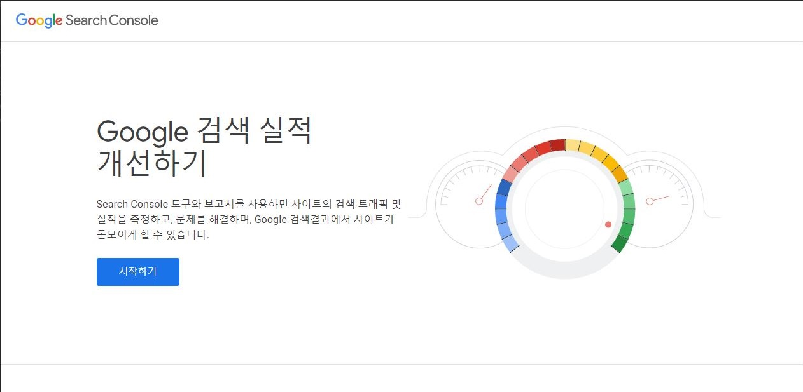
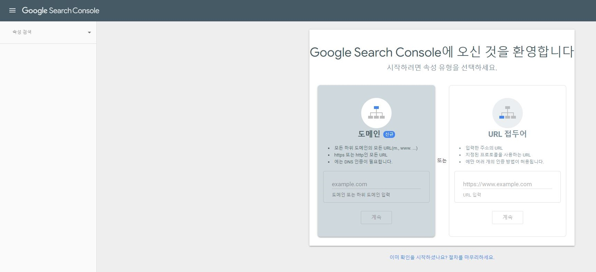
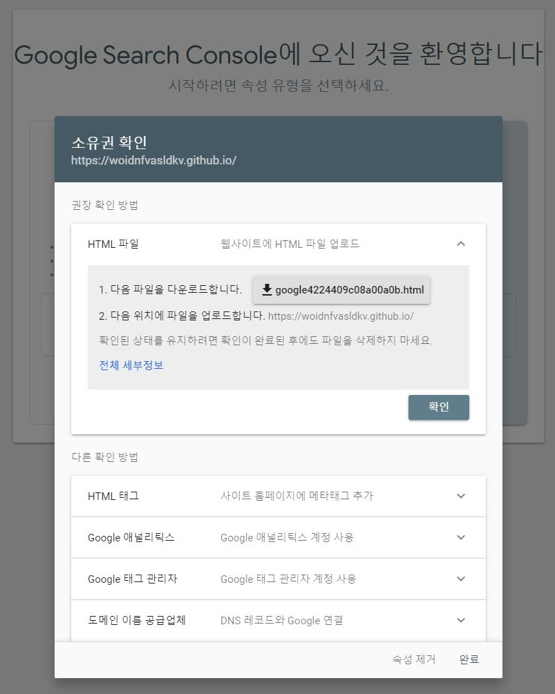
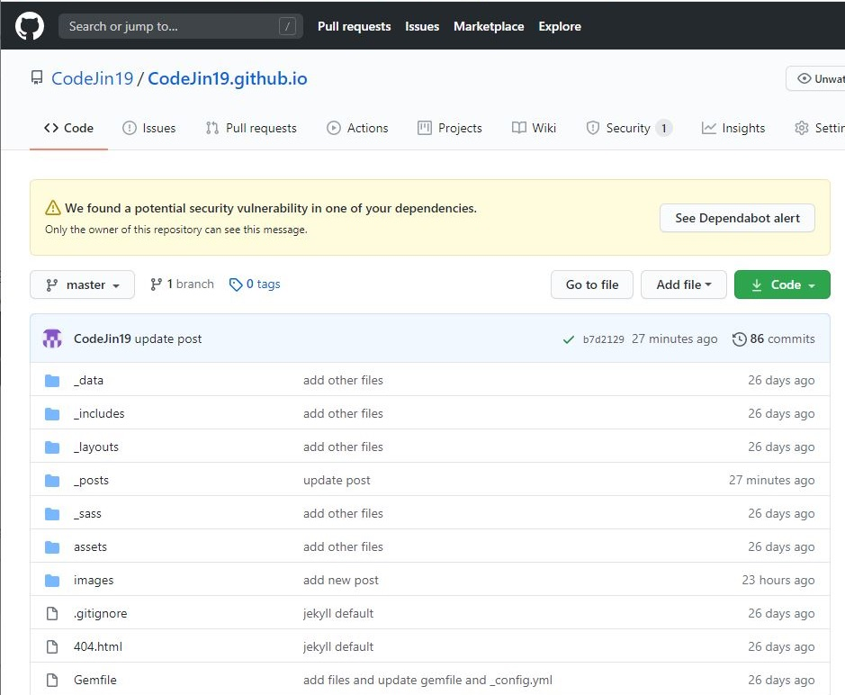
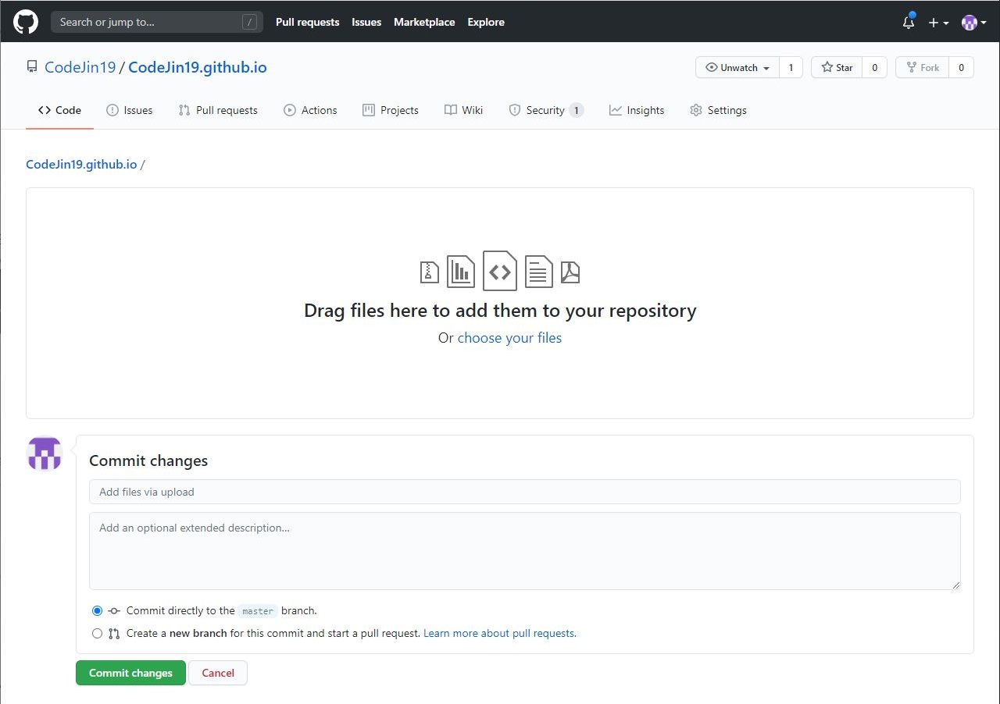
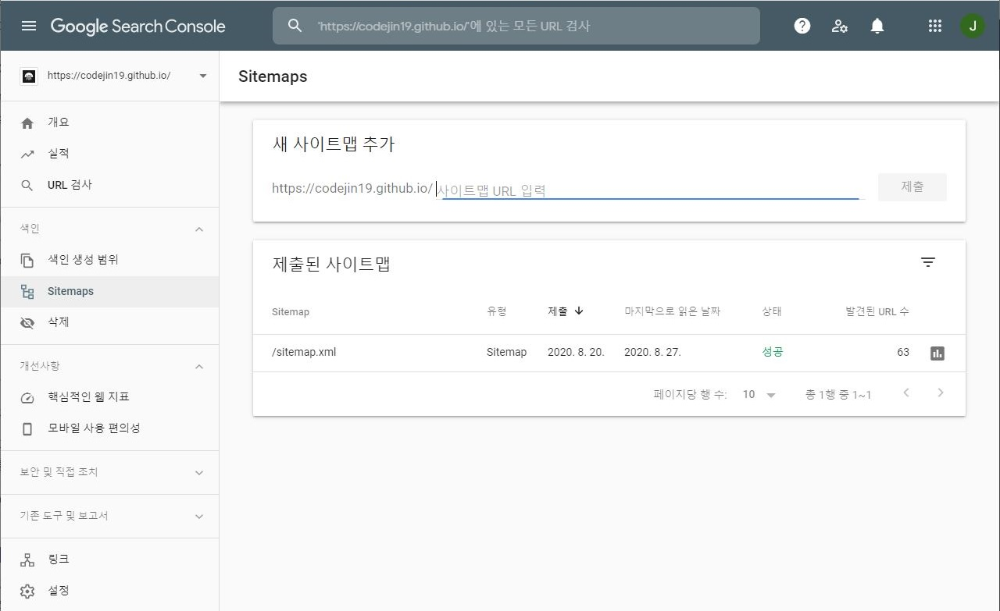

# 구글에 블로그 등록하기

## 지난 시간에...

그 동안 우리는 지킬을 사용하여 블로그를 만들고, 테마를 적용했다.

그리고 완성된 블로그를 깃헙 레포지토리에 올려서 블로그를 온라인으로 볼 수도 있게 됐다.

하지만 구글로 `site:(유저_ID).github.io`로 검색해봐도 결과는 없다.

이번 포스트를 통해 구글에 등록하는 방법을 알아보자.

<br>

## 구글 서치 콘솔

구글에 검색 결과로 내 블로그가 노출되기 위해서는 먼저 구글에 내 블로그를 알려줘야 한다.

그러기 위해 [구글 서치 콘솔](https://search.google.com/search-console/about)에 들어가서 시작하기를 누른다.

<br>

<center></center>

<br>

<center></center>

<br>

시작하기를 누르면 주소를 기입하는 곳이 보인다.

혹시 보이지 않는다면 좌측에 `속성 검색` -> `+ 속성 추가`로 위 화면과 같은 입력창을 띄울 수 있다.

<br>

<center></center>

<br>

위 사진처럼 URL 접두어에 `https://(유저_ID).github.io`를 입력하고 계속을 누른다.

<br>

<center></center>

<br>

그러면 구글에서 소유권 확인을 위해 html파일을 준다.

html파일을 다운받는다.

이 파일은 깃헙 레포지토리 루트에 두면 된다.

<br>

<center></center>

<br>

본인 블로그 레포지토리에 가서 `Add file` -> `Create new file`을 누른다.

<br>

<center></center>

<br>

여기에 다운받은 html파일을 그대로 올리면 소유권이 확인된다.

<br>

## sitemap.xml과 robots.txt

아직 구글 등록을 sitemap.xml과 robots.txt를 생성하고, sitemap을 구글 서치 콘솔에 제출해야한다.

먼저 `_config.yml` 파일에 url 항목에 본인의 블로그 주소가 적혀있는지 확인하자.

그리고 아까 html파일을 올린 위치에 sitemap.xml을 생성하여 다음 코드를 복붙한다.

```xml

---
layout: null
sitemap:
    exclude: 'yes'
---
<?xml version="1.0" encoding="UTF-8"?>
<urlset xmlns:xsi="http://www.w3.org/2001/XMLSchema-instance" xsi:schemaLocation="http://www.sitemaps.org/schemas/sitemap/0.9 http://www.sitemaps.org/schemas/sitemap/0.9/sitemap.xsd" xmlns="http://www.sitemaps.org/schemas/sitemap/0.9">
  
    <url>
      <loc>{{ site.url }}{{ post.url }}</loc>
      
        <lastmod>{{ post.date | date_to_xmlschema }}</lastmod>
      
        <lastmod>{{ post.lastmod | date_to_xmlschema }}</lastmod>
      

      
        <changefreq>weekly</changefreq>
      
        <changefreq>{{ post.sitemap.changefreq }}</changefreq>
      

      
          <priority>0.5</priority>
      
        <priority>{{ post.sitemap.priority }}</priority>
      

    </url>
  
</urlset>

```

<br>

마찬가지로 같은 위치에 robots.txt를 생성하여 아래 코드를 복붙한다.

맨 마지막 줄의 주소는 각자 본인 블로그 주소로 변경해야한다.

```txt
User-agent: *
Allow: /
Sitemap: http://codejin19.github.io/sitemap.xml
```

<br>

이제 다시 [구글 서치 콘솔](https://search.google.com/search-console)로 들어가자.

좌측의 `색인` 항목에 `Sitemaps` 항목으로 들어가면 아래 그림과 같은 페이지가 나온다.

<br>

<center></center>

<br>

사이트맵 url 입력 창에 `sitemap.xml`을 입력 후, 제출하면 구글 등록 완료!

제출을 했다면 위 이미지의 `제출된 사이트맵` 항목과 같이 성공으로 나와야 한다.